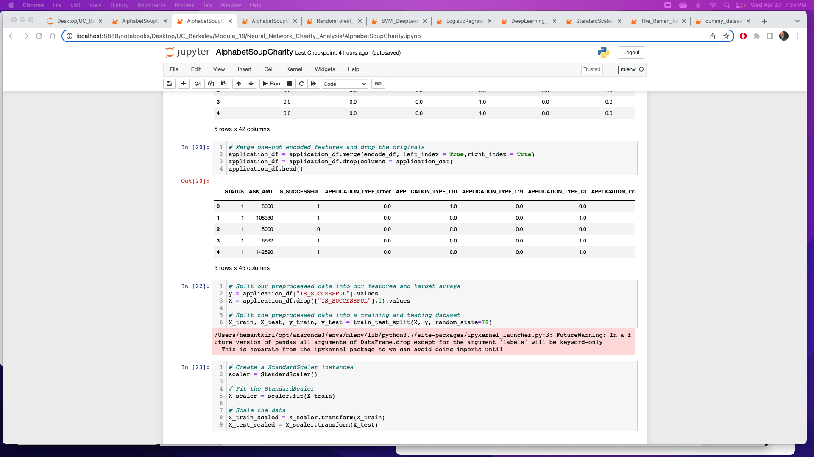
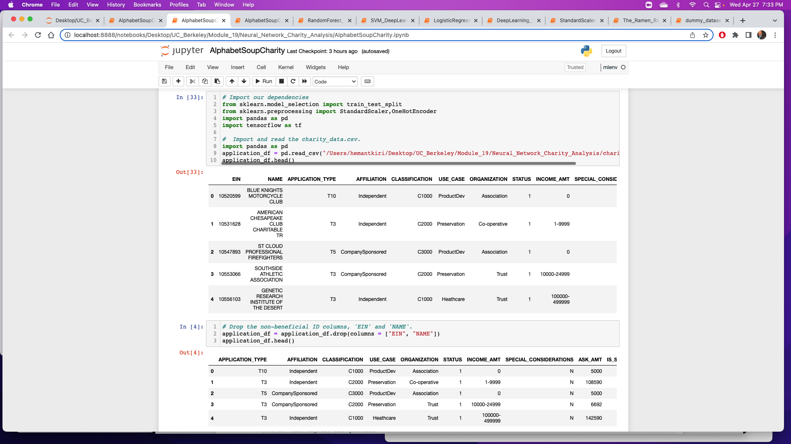
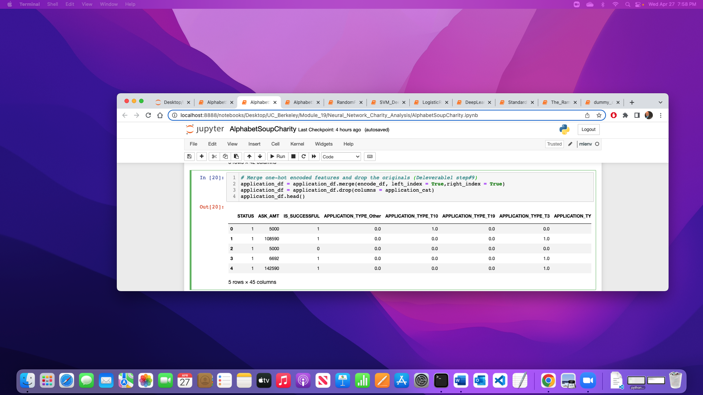
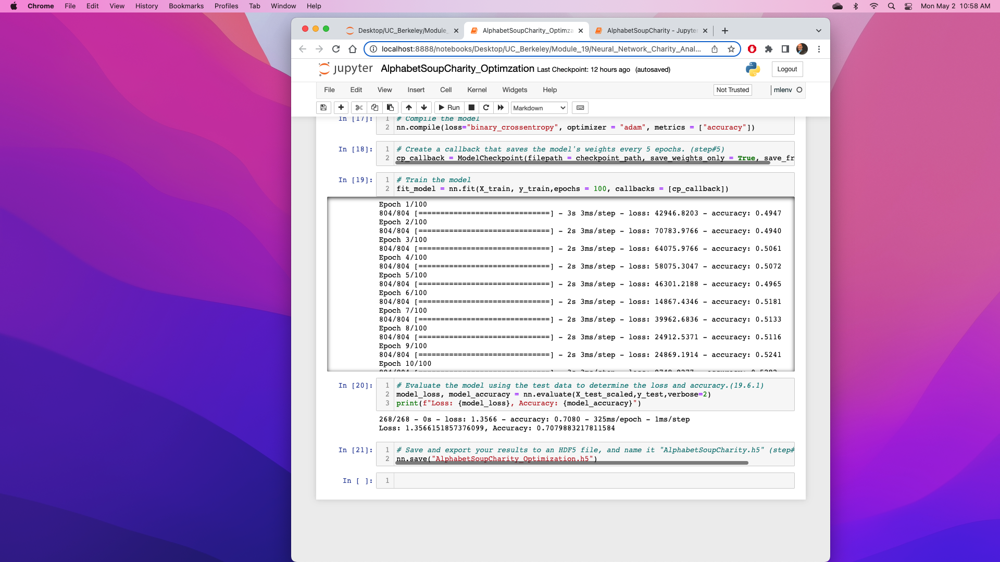

# Neural_Network_Charity_Analysis

# Overview of the analysis:
The purpose of this project to predict if the applicants that will be funded by a Charitable organization called Alphabet Soup will be successful. The data “charity_data.csv” file has 34299 rows and 12 columns information. 

# Data Processing

“IS_SUCCESSFUL” is variables considered the target for this model.

Drop the non-beneficial ID columns, 'EIN' and 'NAME'

Merge the one-hot encoding DataFrame

Keras model Sequential

Model loss and accuracy

# Summary:
The model accuracy is 71%. Model successful target was 75%.  I drop two columns ‘EIN’ and ‘Name’, determine the number of unique values for each column. I can get the 75% target if I drop more columns.

My recommendation is to use Random forest classifiers, becasue
(19.5.4)
Random forest classifiers are a type of ensemble learning model that combines multiple smaller models into a more robust and accurate model.
Random forest models use a number of weak learner algorithms (decision trees) and combine their output to make a final classification (or regression) decision. 
Both output and feature selection of random forest models are easy to interpret, and they can easily handle outliers and nonlinear data.
